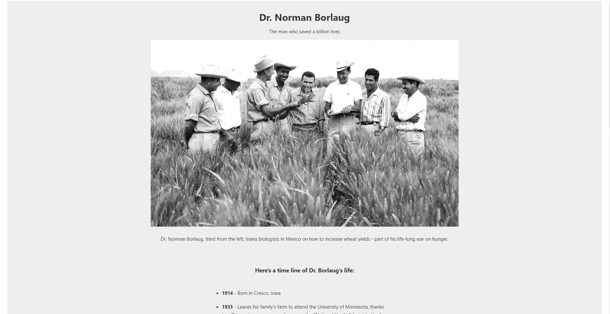
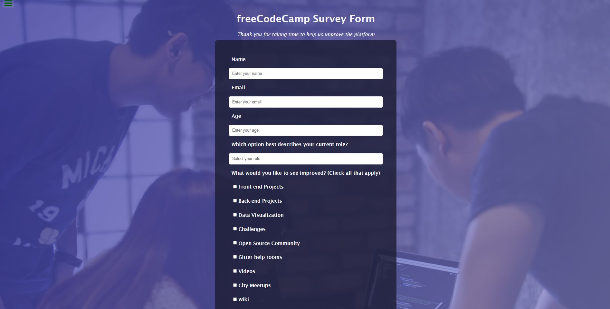
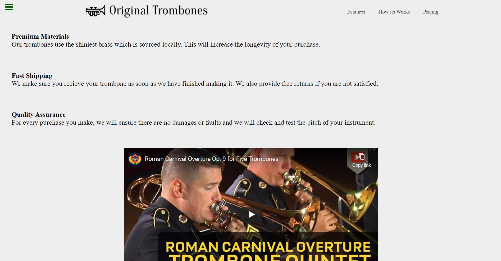
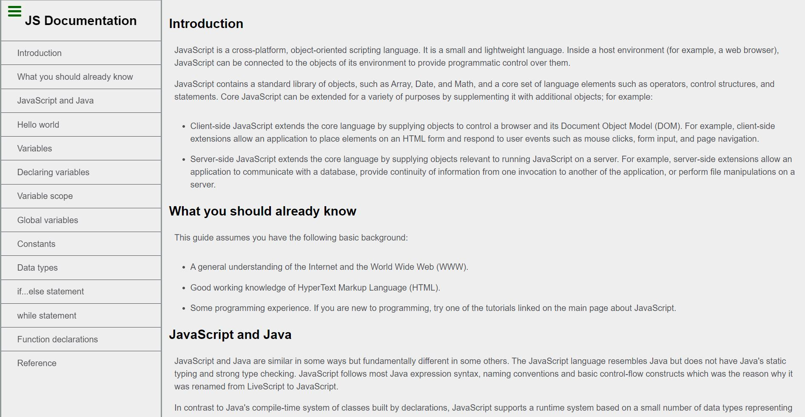
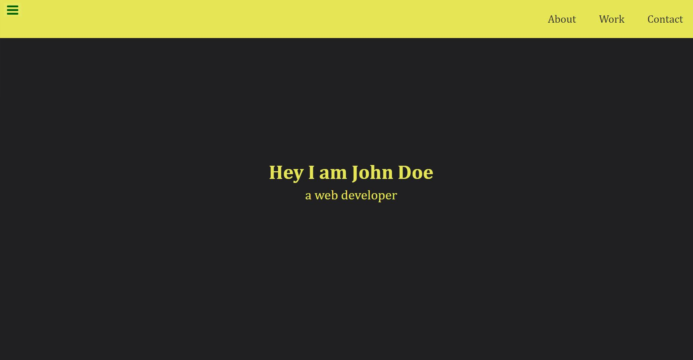
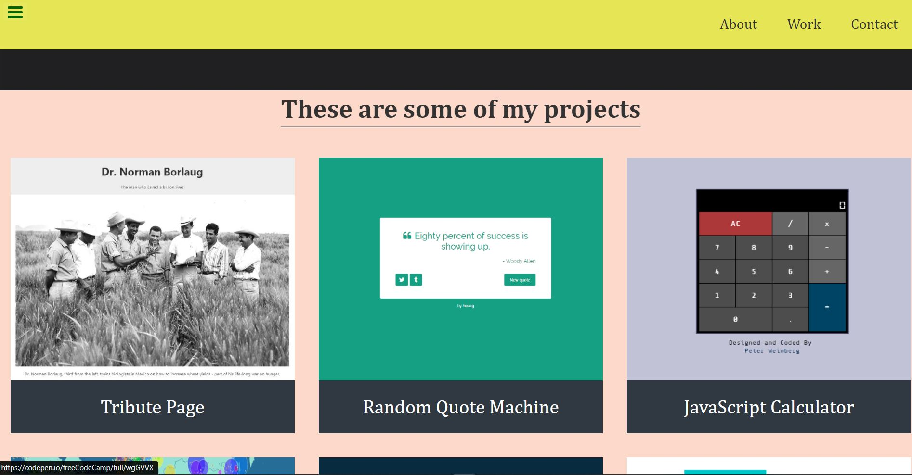

# Responsive-Web-Design-Projects

FreeCodeCamp Responsive Web Design Certification Projects.

# Projects Preview

## Tribute Page [codepen](https://codepen.io/harshvardhanjosh/pen/MWJxVKK)

## Survey Form [codepen](https://codepen.io/harshvardhanjosh/pen/MWJxVNo)

## Product Landing Page [codepen](https://codepen.io/harshvardhanjosh/pen/mdRogjV)

## Technical Documentation Page [codepen](https://codepen.io/harshvardhanjosh/pen/ExZJYPB)

## Personal Portfolio Webpage [codepen](https://codepen.io/harshvardhanjosh/pen/rNjbNvy)

# License & copyright

@ Harshvardhan Joshi

License under the [MIT License](LICENSE)
